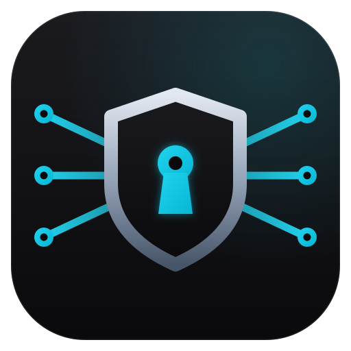
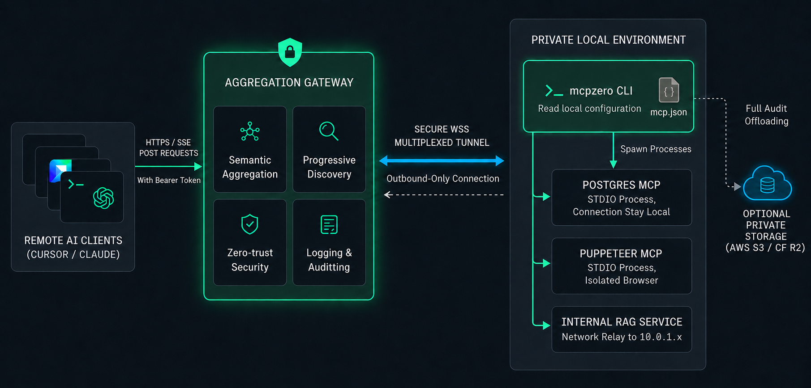

<p align="center">
  
</p>

<h1 align="center">MCPZERO</h1>

<p align="center">
  <strong>Publish, aggregate, secure and share local MCP servers in minutes.</strong>
</p>

<p align="center">
  <a href="https://mcpzero.io">Website</a> ·
  <a href="https://mcpzero.io/docs/">Docs</a> ·
  <a href="https://mcpzero.io/app">Dashboard</a>
</p>

MCPZERO is a **secure MCP aggregation gateway** for the
[Model Context Protocol](https://modelcontextprotocol.io). It publishes,
aggregates, and secures local MCP servers behind one zero-trust gateway URL so
agents can discover tools on demand instead of loading every schema upfront.

```
your MCP servers (no auth) ──tunnel──▶ gw.mcpzero.io ──▶ aggregation gateway ──▶ Cursor / Claude / Codex
                                  │                    (auth · aggregate · audit)
                              dashboard: endpoints, API keys, call ledger
```

## Why MCPZERO

| Pillar | What it means |
|--------|---------------|
| **Zero-Config** | Reads your existing `mcp.json` and multiplexes every local stdio server through one encrypted tunnel — no domains, TLS, or hosting to manage. |
| **Zero-Trust** | Every public endpoint is enforced at the edge. Clients authenticate with `Authorization: Bearer`; auth resolves in under 5ms and the protocol surface of your tools is never exposed to the internet. |
| **Zero-Leak** | The gateway forwards in-memory and persists metadata only (tool, latency, status). Request/response bodies are never stored by default — stream full audit logs to your own S3 / R2 / OSS on paid tiers. |
| **Zero-Friction** | The Semantic progressive discovery of tools reduces token usage and 'context bloat' |





## Semantic aggregation

Combine many local MCP servers behind one endpoint. Each server keeps its own
public path; the endpoint root becomes a **meta server** that routes tool calls
to the correct backend.

```bash
mcpzero tunnel start --endpoint ep_abc123 --mcp-config ./mcp.json
# reads mcp.json → postgres, filesystem, puppeteer — one tunnel, many servers
```
See [example `mcp.json` file](examples/quickstart/mcp.json)

See [Semantic aggregation](https://mcpzero.io/docs/gateway/semantic-aggregation/).

## Progressive discovery

AI clients discover tools on demand instead of loading every schema upfront.
The meta server exposes `meta_search` and `meta_call_tool` so agents match
intent to concrete tools without wasting context tokens.

See [Progressive discovery](https://mcpzero.io/docs/gateway/progressive-discovery/).

## Gateway intelligence

Beyond transport and auth, MCPZERO inspects and orchestrates MCP traffic at the
edge:

- **Semantic WAF** *(Enterprise · Roadmap)* — a content-aware firewall that understands
  JSON-RPC and tool schemas. Inspects every `tools/call` for malicious
  arguments, unsafe paths, and data-exfiltration patterns.
- **Tool Hijacking Defense** *(Enterprise · Roadmap)* — scans tool arguments and returned
  content for injection and jailbreak payloads, neutralizing compromised tools.
- **Team sharing & audit** — share endpoints across members, visualize traffic,
  and retain searchable audit logs; NDJSON export and webhook alerts on Personal+
  (Team adds higher caps and team-scoped alerts).

## Get started

**Tunnel a local server with the CLI:**

```bash
curl -fsSL https://mcpzero.io/install-cli.sh | sh`
# or: brew install mcpzero/tap/mcpzero-cli
# or: npm install -g mcpzero-cli
# or: pipx install mcpzero-cli
mcpzero version
mcpzero login
mcpzero init
```

The CLI source lives in [`cli/`](./cli/); see its [README](./cli/README.md) for
building from source and the full command reference.

## Repositories

| Repo | What | License |
|------|------|---------|
| [`mcpzero`](https://github.com/mcpzero/mcpzero) | This repo — docs, examples, install script, protocol spec, and the CLI | MIT |
| [`homebrew-tap`](https://github.com/mcpzero/homebrew-tap) | `brew install mcpzero/tap/mcpzero-cli` | — |

## Documentation

- Product docs: https://mcpzero.io/docs (source of truth lives in [`docs/`](./docs/))
- Tunnel wire protocol: [`PROTOCOL.md`](./PROTOCOL.md)
- Runnable examples: [`examples/`](./examples/)

## License

Content in this repository (docs, examples, install script) is MIT — see
[LICENSE](./LICENSE).
